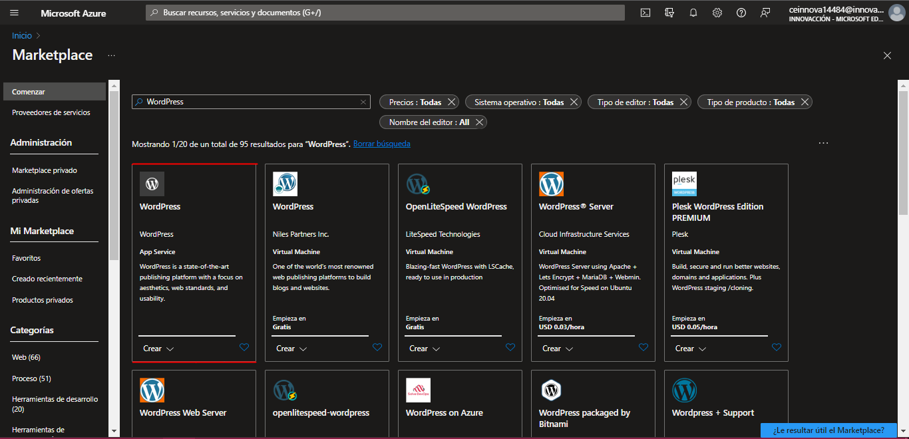
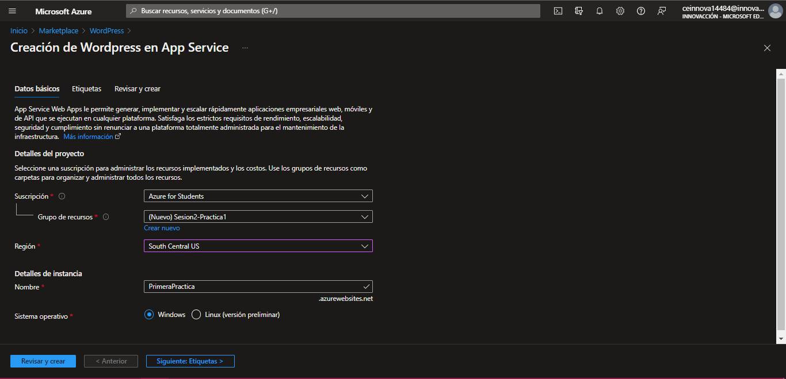
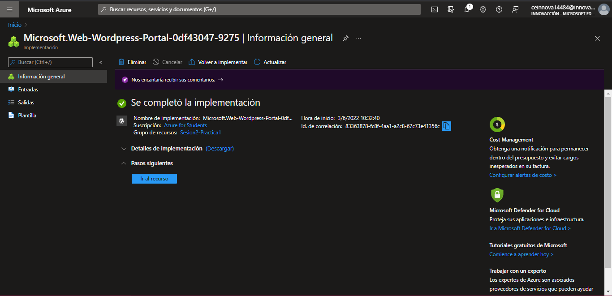
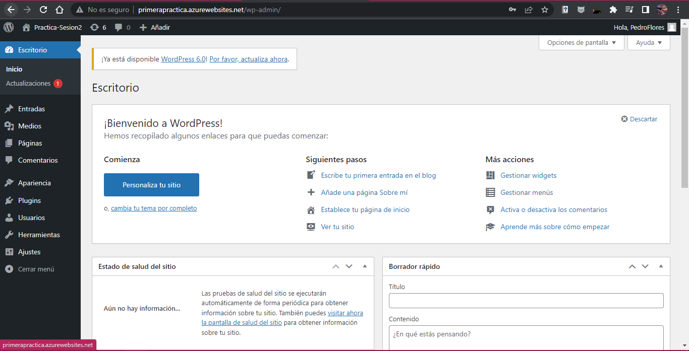

# Sesion 2: Introduccion a Azure

En esta sesion vimos las caracteristicas basicas de la nube de Azure y los tipos de modelos de Nube.

La practica realizada consistio en la creacion de nuestro primer recurso de Azure, el cual buscamos en la MarketPlace de Azure como WordPress.

Despues de seleccionar el recurso, proporcionamos los datos necesarios para la creacion del recurso.

Una vez dados los datos, seccionamos la opcion de _crear_ y esperamos que se implemente nuestro recurso.

Este recurso consiste en un asistente para la creacion de una pagina web. Puede ser considerado como un PaaS, ya que no nos da una pagina web lista, sino que todavia tenemos que construirla.

Y con eso concluye la practica de esta sesión.

